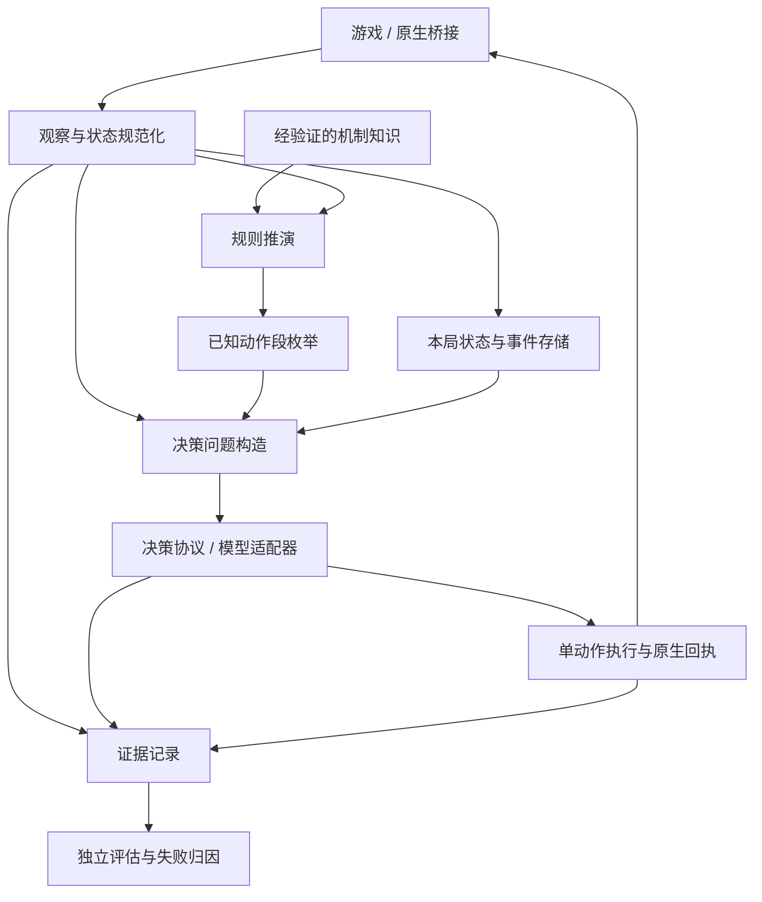

# 全局架构重规划

日期：2026-10-05。状态：2026-10-06 开始按阶段实施，见 `implementation-20261006.md`；整体迁移与策略验收尚未完成。

配套证据：`docs/decision-root-cause-investigation.md`。本方案以当前代码、实际失败日志、独立复现和 30 次真实 HTTP 对照为依据，不以单元测试数量代替决策质量。

## 1. 系统应当承担什么

目标是在游戏允许行动时，基于可见信息选择并执行有效策略，逐步提高整局表现；出错时能定位责任层，恢复时不会重放动作或污染另一局。

系统需要同时满足四类正确性，分别验收：

1. **事实正确**：状态、合法选项、能力和事件机制没有丢失、混淆或假装已知。
2. **推演正确**：能够推演的部分与游戏规则一致；尚未知的部分明确标出。
3. **判断可靠**：模型能在给定事实和选项下做出合理选择，尤其不能频繁放弃明确活路。
4. **执行可靠**：选择对应正确的原生命令，动作只执行一次，恢复与重试有确定语义。

当前第 4 类已有较好的实测证据，第 3 类显然未达标，第 1、2 类也仍有契约和覆盖问题。继续增加提示词或测试总数，无法代替这四类问题的分别解决。

## 2. 当前架构为何不合理

### 2.1 数据并没有形成一个统一的游戏状态模型

`models.py` 只有很薄的 TypedDict。实际状态和动作的约定分散在 `state.py`、`screens.py`、`rules.py`、`turn_planner.py`、`session.py` 中。

观察状态、模拟状态、执行匹配投影对字段的理解不同。已复现：搜索认识 `free_to_play_once`，复用匹配却看不到它，实际费用改变后仍可复用旧步骤。新增字段必须到处补判断，遗漏会变成隐性错误。

### 2.2 本局身份与恢复身份混淆

`run_id`、controller session、seed、battle identity、floor 被交替用来标识不同对象。`_restore_memory()` 以种子等属性读取所有历史，会把同种子旧局的跳过记录带入另一局恢复会话，直接过滤本局奖励。

相同种子不等于同一次游戏；同一层也不等于同一个奖励来源或同一场战斗。这个问题需要身份契约解决，不能再给记忆过滤器增加特例。

### 2.3 “已知事实”“规则覆盖”“策略建议”混在同一层

怪物机制里既有分裂阈值、偷钱数量等事实，也有“应比较进攻”等建议。B 编码为去掉建议而移除了整个 `encounter_mechanics` 块；原生描述仍在，但结构化事实无法独立保留。

“没有读到字段”“规则尚未实现”“未来抽牌随机”“某遗物只在下回合触发”都可能进入同一个 uncertainties 列表，从而把整回合切换成逐张决策。香炉导致大量额外请求，就是这种粗粒度覆盖判断的后果。

### 2.4 一份 outcome 混合了多个时间点

现有 `enemy_hp_by_target`、`remaining_energy`、`block` 是打完计划中卡牌后的值，`player_hp_after_turn` 则来自假设结算敌人攻击后的值。未实际 END 的抽牌前缀也会计算“假如此刻结束”的结果。

这使“结果”不是一个明确状态。尤其剩余能量 3 并不表示下回合能保留 3，当前格挡也不等于下回合格挡。字段正确的局部算术，不能弥补时间语义不清的接口。

### 2.5 决策协议藏在编码与异常处理里

`selectors.py` 同时承担战略上下文、编码、SDK 调用、重试、分组比较、概率校验。一次上下文错误可以改变选项表示和比较树；商店与战斗采用不同的比较协议，却难以独立评估。

官方 Choice 最多 255 个选项，SDK 构造器仍接受 256 项，当前网关没有独立的能力检查。CPU 枚举成本与模型可处理的选项/上下文规模必须分开。

Jev System One 的定位是快速、集中的判断，不能未经验证就把一次宽泛分类当成整局规划器。这次固定输入对照已经显示了其选择不稳定性。

### 2.6 会话控制器承担了过多职责

当前 `session.py` 为 827 行，`receive()` 为 249 行，模块中有 53 个 self 写入字段。它同时处理启动、状态、战斗、购物、记忆、模型、计划队列、事务、暂停恢复和报告。

危险不在行数本身，而在状态组合隐含：模型待返回、原生已接受、逻辑出牌待选牌、旧计划还可复用等不同状态，挤在 pending/sent/phase/多个布尔值里。

### 2.7 评估和日志不足以支持因果归因

日志反复写整份状态和计划，已累积到 GB 级；恢复却要扫描历史。另一方面，以前没有逐请求保留实际 HTTP 请求/原始响应，因此关键异常反而缺少证据。

326 个本地测试通过与两局 0/2 通关可以同时成立。原 ABC 的斩杀用例只有同一战斗中的两个局面，无法覆盖有活路却选择死亡、长期成长敌人、构筑和事件判断。

## 3. 总体结构

保持一个 Python 应用进程与现有 Java 原生桥接。用明确契约和事件驱动协调，不先引入分布式服务或新的代理群。



五项边界必须保持：

- 规则引擎不调用模型、不写日志、不发送游戏命令。
- 编码器不判断哪条策略更好，不删除合法方案。
- 模型适配器不操作游戏，也不负责恢复游戏进程。
- 执行器不根据概率或收益分数替模型改招。
- 评估失败不能伪装成原生执行失败；是否实验性复核属于显式决策协议。

## 4. 核心契约

### 4.1 身份

| 身份 | 生命周期 |
|---|---|
| RunId | 一次实际游戏，控制器重启不变；同种子新局必须不同 |
| ControllerId | 一次控制器进程，重启即变化 |
| EncounterId / RewardSourceId | 一次战斗或奖励来源，不能只用 floor 代替 |
| ObservationVersion | 原生 epoch、revision 与所属 RunId |
| DecisionId | 对一份决策问题作判断，独立于请求重试次数 |
| RequestId | 一次具体模型请求，包括重试/分组子请求 |
| TransactionId | 一次原生输入，重复投递仍使用原 ID |

RunId 必须持久化并绑定游戏会话，不能根据 seed 猜测。恢复先确认本局和未完成事务，再加载该局记忆；关联不明时禁止导入别局的跳过记录。旧日志的身份修复作为离线迁移处理，不静默混入新执行。

怪物需要观察作用域内的稳定实体引用。若桥接尚不能提供实例 ID，使用带版本的原生索引，状态变化后重新绑定；不能用“同名怪物”当成同一个目标。

### 4.2 观察与知识

一个规范化 Observation 保留玩家、手牌、各牌堆、怪物、能力、遗物、药水、节点、原生合法选项，以及来源与缺失字段元数据。

- 零、缺失、不适用、随机未知是不同状态。
- 原生 ID 与展示名称分开；别名转换只在规范化边界做一次。
- 不将缺失伤害/类型悄悄变成零或 STATUS，再宣称完整枚举。
- 只使用可见信息和经验证规则，不泄露尚未知的抽牌顺序或未来 RNG。
- 机制事实单独存储：触发阶段、条件、对象、效果、证据版本。建议性文字进入策略层，不混进事实块。
- 规则未覆盖一张牌，不意味着这张原生合法牌不能成为候选。

核心域使用明确的枚举、不可变数据结构和动作联合类型；JSON 字典只留在外部边界和存储格式，不作为每层共享的可随意增删字段的对象。

### 4.3 决策单位：到下一个信息边界的动作段

不用“turn_plan 必然是完整一回合”的模糊约定。统一使用 DecisionSegment：

```text
Segment = 起始观察版本 + 动作序列 + 边界类型 + 前置条件 + 覆盖说明
Boundary = EndTurn | NeedObservation | NeedChoice | CombatEnded
```

- 普通攻击、防御、已验证确定效果：继续枚举。
- 未知抽牌、随机消耗/生成、未建模反应：停在真实信息边界，读取新状态后再决定。
- 已知的指定消耗/升级：可以把目标纳入动作段；原生选牌界面是执行子步骤，不一定需要再问模型。
- 原生接受了出牌输入，不代表这张牌的所有选择和效果已完成。把输入事务与逻辑动作段分开。
- 能量是合法性资源，不是“最多三个动作”；药水、零费牌、回能量和已知选择都纳入规则约束。

每个当前原生合法动作必须能成为某个候选的起点；无法推演后续时，至少保留有明确未知边界的原生动作段。不能把规则覆盖不足转换成“只剩 END”。

### 4.4 推演结果按时间点分开

```text
Prediction
  after_actions              已列动作后的 HP、格挡、能量、能力等
  if_end_now                 假如此刻 END 的已知攻击/结算后结果
  next_start_known_effects   有规则依据的延迟事实
  unresolved                缺失事实、随机信息、未实现效果
```

若动作段本身包含 END，可将对应结算作为该段结果；若动作段止于抽牌，不能把 if_end_now 冒充执行这段的最终后果。

对模型的简易视图可以很短，但字段名、时间点和单位必须明确，例如“出牌后未用能量”与“下回合保留能量”分开。预测 0 HP 明确是绝对剩余 HP，不是零伤害。精简视图与详细审计使用同一结构生成，不再各写一套结果解释。

## 5. 规则与枚举

把 `rules.play()` 中的大分支分为可测试的效果处理：牌、能力、遗物触发、敌人反应及阶段结算。使用简单的处理函数注册表，先覆盖当前铁甲战士/原版范围，不为未知模组承诺通用模拟。

每个处理器明确读取/修改哪些状态、是否有待观察信息、证据来源和验证状态。原生当前合法性仍由游戏决定，未来步骤的模拟合法性由已覆盖规则负责。

枚举器只探索、去重、记录覆盖，不评分。资源保护触发时报告未探索范围，并显式选择已定义的退化协议；不能把残缺集合叫作完整计划集。

状态等价与执行前置条件使用同一语义模型。把审计文本、编码引用、日志计数从 SimState 中分离，避免它们妨碍去重。初期采用保守等价；只有证明卡牌身份可互换且所有未来相关字段一致，才合并相同结果。不能按七项 B 数字相同就合并：力量、牌堆、费用和遗物计数可能不同。

原有 projection 要替换为明确的语义前置条件，覆盖免费出牌、一次性消耗、保留、费用、目标实例、能力和计数器。观察到差异就重新构造问题，不能先执行再靠下一步失配补救。

## 6. 决策层：重新定义问题，而不是继续堆提示词

引入独立 DecisionProblem：

```text
DecisionProblem
  observation_ref
  task / objective
  native_facts + mechanism_facts
  candidates + completeness
  prediction_view
  protocol_version
```

### 职责划分

- ContextBuilder 组织本局事实、当前任务与已确认历史，不产生“应该买什么/防御优先”等隐藏分数。
- View 选择信息量：A/B/C 是可实验的信息投影；不是散落在 selector 中的分支。
- Encoder 只负责字典、表格、共享引用等表示。可还原语义不代表模型理解不受影响，因此编码也要做模型行为回归。
- DecisionProtocol 规定一次平面选择、分组比较或实验性复核的流程。它与网络重试分开，不能由一个异常处理函数偷偷改变策略。
- ProviderAdapter 管理 SDK、接口能力、请求和响应。记录 Choice 上限 255、上下文错误和实际模型版本，避免发送明知不符合接口契约的问题。

### 对 Jev 的定位

保留 Jev 作为当前候选后端，但以任务能力测试决定它承担哪些判断。官方只承诺受约束的快速判断，不承诺给出长链规划或解释。

此次对照表明，聚焦当前生存的判断能答对，而宽泛整局目标和大候选集不稳定。因此下一步应比较明确任务协议、候选表示与后端能力，不直接把“更长提示词”作为解法。其他后端仅作为可替换接口，实际使用仍需配置和授权，不在此次规划中自动引入。

不把概率当作游戏胜率，不用未经校准的 confidence 阈值自动执行/暂停。choice 与概率最大项不一致时按供应方契约异常留存原始证据；不再声称它没有接口依据，也不把它与游戏拒绝动作混成一个错误。

### 保持决策权与可验证性

程序拒绝非法、过期、重复或身份不明的动作。策略层可以记录“选了预测死亡而另有已验证活路”等冲突；是否增加一次模型复核，必须作为独立协议做留出集实验。不能暗中改为本地强选、重新加伤害/血量权重，或引入永远禁用 END、永远不对大块头用技能的规则。

聚焦生存与两项对照的 5/5 只是诊断结果，不足以立刻切换整个游戏策略。复核失败如何处理也应明确，不能无限追问到模型给出想要的答案。

## 7. 执行与运行控制

保留 `TransactionLedger`、`ActionProtocol` 和本地在途日志的关键语义：epoch/revision、同 ID 重投、接受后只查询、结算后提交。既有原生回执测试继续作为迁移保护。

拆开三个状态机：

1. 观察：稳定可决策 / 过渡中 / 游戏结束。
2. 决策：空闲 / 构造问题 / 等待模型 / 结果过期。
3. 执行：空闲 / 已准备 / 已发送 / 已接受 / 已结算 / 被拒绝。

Coordinator 只处理事件并产生副作用请求，不直接执行网络、文件和规则计算。模型调用可放入异步任务或受控工作线程，输入读取和原生回执处理保持活跃。旧结果按观察版本丢弃；取消本地等待不等于远端推理被取消，更不能因此重复游戏输入。

Executor 每次只发一条命令，使用当前观察将领域动作解析为原生索引。模型无需知道 `JEV_ACTION` 格式。逻辑选牌步骤、状态失配、原生接受/结算分别可追踪。

增加本局控制器所有权锁，防止两个进程共享同一 pending journal。暂停/恢复命令带 RunId 和命令 ID。迁移期间先完成旧事务核对，再加载新控制器；禁止在在途动作中随意热替换部分模块。

## 8. 非战斗节点也使用相同的决策契约

战斗、事件、商店、奖励、营火、地图都生成 DecisionProblem，但使用各自任务和结果单位。

- 费用明确区分金币、HP、最大 HP 和未来打牌能量。
- 卡牌明确区分永久加入、临时生成、升级、移除、回收和消耗。
- 有可靠原生目标列表时，删牌/升级的具体目标应成为后续选择的一部分；无法提前知道时明确 NeedsChoice，不伪造收益。
- 商店价格变化、药水替换、删除卡牌等都有观察边界和费用支付时点。
- 奖励来源独立标识，不能只凭同一楼层的旧 skip 记录过滤。
- 自动操作仅限已定义且无战略取舍的流程步骤。当前“免费遗物就自动拿”仍含价值假设，应与真正的无成本查看界面区分。
- RunContext 保存事实：当前牌组、资源、可达路线、已知 Boss、已发生选择。模型提出的偏好如需保存，必须与事实分开并有失效条件。

不能用购买次数或拿牌次数评价策略好坏，也不能把战斗的简易结果格式直接套在事件收益上。

## 9. 日志与评估成为基础设施

采用每局独立记录和可查询索引；可先用标准库 SQLite 管元数据，加内容寻址文件保存压缩状态/候选/请求。原生在途日志先保留，待事务迁移测试通过再决定是否合并存储。

每个模型尝试记录：DecisionId、RequestId、完整实际请求 body、原始响应、映射表、输入/规则/视图/协议/模型版本、耗时分解和错误类型。不得记录鉴权头；未报告的 token 数记未知，不当成零。

每份大状态只存一次，事件引用其 ID。避免一条动作的多个事件各复制整套状态与计划，也避免恢复扫描全量 GB 日志。

评估分为：

| 层 | 核心验收 |
|---|---|
| 观察 | 原生字段/合法选项覆盖、身份隔离、未知值不变零 |
| 规则 | 与原生 before/action/after 对齐的差分验证，独立关键算术，不以同一模拟器作唯一 oracle |
| 枚举 | 每个合法起点被覆盖、信息边界明确、截断如实报告、合并有等价证明 |
| 模型协议 | 斩杀、生存、无代价收益遗漏、机制误判、非战斗取舍、排列/标签/编码敏感性 |
| 执行 | 错 ID、陈旧 revision、丢回执、重复投递、进程恢复和选牌子步骤 |
| 整局 | 正常运行与控制实验分开；固定起始条件、实际种子、模型版本；失败/超时均保留分母 |

数据按独立游戏/战斗划分开发集和留出集，同一战斗相邻帧不得充当独立泛化样本。新增致死反例进入留出验收。技术就绪与策略就绪分开报告。

## 10. 目录与依赖方向建议

以下为目标边界，不要求第一步一次创建所有文件：

```text
slay_jev_spire/
  domain/       observation、identity、actions、segments、prediction、errors
  observation/  native_adapter、screen_adapters、mechanism_facts
  simulation/   engine、cards、powers、relics、enemy_reactions
  planning/     enumerate_segments、equivalence
  policy/       context、views、encoding、protocols、jev_provider
  runtime/      coordinator、executor、native_transport、control
  storage/      events、snapshots、run_registry
  cli.py        组合与入口
evaluation/     cases、profiles、runners、metrics、legacy_readers
```

依赖只向领域契约收敛。runtime 组合接口；domain 不依赖 SDK、文件系统或 tools；线上不导入实验模块。原生 Java 层保留协议与观察导出，benchmark 的改血量/牌组逻辑与正常导出配置隔离并明确标记。

### 主要接口

```text
normalize(NativeFrame) -> Observation
apply(SimState, DomainAction) -> Transition(state, effects, boundary, coverage)
enumerate(Observation, RuleCapabilities, ComputeBudget) -> CandidateSet
build_problem(Observation, CandidateSet, RunContext, Task) -> DecisionProblem
choose(DecisionProblem, ProtocolProfile) -> DecisionResult
resolve(DomainAction, Observation) -> NativeCommand
reduce(RuntimeState, Event) -> (RuntimeState, Effects)
```

DomainAction 是数据，不是可执行字符串。模型只能返回当前 DecisionProblem 的候选 ID；resolve 使用新鲜观察生成命令。规则计算产生 Transition，不得自行触发网络或原生动作。

| 现有实现 | 目标处置 |
|---|---|
| models.py | 改为真实领域契约，区分观察、动作、动作段、预测、模型响应与原生回执 |
| state.py / screens.py | 保留原生适配和描述解析，移出策略与旧确认兼容逻辑 |
| rules.py / monsters.py / position.py | 分离纯状态转移、分阶段机制事实、时间明确的预测；保留已验证规则 |
| turn_planner.py | 只保留枚举与等价关系；命令绑定移交执行器，模型表示移交视图 |
| selectors.py | 拆分上下文、信息视图、编码、决策协议、Jev 适配器，避免网络错误直接决定策略流程 |
| session.py | 由事件驱动 Coordinator 和独立计划/事务状态替换 |
| transactions.py / 原生账本 | 保留语义与故障测试，封装成执行端口；不随策略重写 |
| records.py / 各种日志脚本 | 合并为可查询的本局存储与统一诊断入口，旧格式只读迁移 |
| tools 中的实验代码 | 归入 evaluation；线上不依赖离线工具，历史 C 视图版本冻结 |

## 11. 分阶段迁移与验收门槛

### 阶段 0：建立可复查基线

冻结当前版本、模型输入视图和失败样本，补齐实际请求/响应记录与错误分类。此次调查工具和证据可作为起点。停止用提示词零碎变动掩盖基线。

### 阶段 1：身份与规范状态

引入 RunId/EncounterId/RewardSourceId，修复跨局恢复；建立同一套动作相关状态，修复免费标志等复用遗漏。旧日志只由专门适配器读取。

门槛：同种子不同局绝不导入旧 skip；同局重启能恢复；所有会改变费用/目标/效果的字段变化都触发正确的计划失效。

### 阶段 2：明确推演时间点与信息边界

将 outcome 拆成 after_actions、if_end_now、延迟事实与未知；拆出局部效果处理器及覆盖声明。当前原生合法动作不因规则未实现而消失。

门槛：85 个已独立核对的候选保持正确；抽牌、指定消耗、随机消耗、香炉、分裂、守护者和小偷用例明确分阶段；缺失字段没有被误判为确定零值。

### 阶段 3：独立决策协议和供应方适配器

将上下文、信息量、编码、任务与选择协议拆成可分别测试的纯组件。处理 255 选项约束、上下文错误和原始响应留存。B 作为参考配置，不当作已经解决全局策略。

门槛：编码/解码和候选映射守恒；超过上限的请求不直接发出；在独立生存与机制留出集上验证协议，不能只看斩杀 6/6。新增复核或分组机制均需记录全部候选及协议变化。

### 阶段 4：替换中央会话控制器

用事件驱动 Coordinator 与独立 Executor 替换 receive() 的交织状态。先接一条战斗纵向路径，再接选牌、恢复和终局。保留原生事务层。

门槛：既有丢回执/重复/陈旧状态/控制器恢复测试通过，实际选牌子步骤不中断；模型等待期间能处理新状态，不重复发游戏动作。

### 阶段 5：统一非战斗决策与整局评估

迁移事件、商店、奖励、营火和地图，取消混在流程控制里的价值假设。建立固定起始条件的整局对照与常规运行报告。

门槛：奖励身份正确、费用与后续目标明确；策略质量单独评价。若后端仍不能可靠处理目标任务，先更换/重新验证决策协议或后端能力，不继续扩建一个无法证明有效的价值公式。

跨回合模拟或可学习的局面价值应在这些基础通过之后开展。其标签来自真实结果或经验证的 rollout，不手工拼 HP、伤害、药水权重；敌人未来招式或抽牌分布未知时必须显式保留未知。

## 12. 保留、替换、归档

- **保留并封装**：原生事务回执、持久化未完成命令、已验证的原生字段导出和规则测试、原始实战/ABC 证据。
- **优先替换**：跨局记忆恢复、薄弱的计划前置条件、混合时间点的结果字典、巨型 RunSession、混合编码/策略/网络的 selector。
- **归档到评估侧**：C 的历史编码、旧日志兼容、一次性诊断和原生恢复注入工具。正常运行不加载它们。
- **逐步删除**：重复描述/转换、已忽略的 beam 参数和陈旧指标、启动入口里的并行控制路径、未被新验收覆盖的旧特殊分支。每次删除要有调用关系与回归证据。

## 13. 实施纪律

每一阶段先用反例写清契约，再迁移一个可运行的纵向流程，最后删除旧路径。部署使用带来源哈希的完整版本，先在 Windows 验证，再切换启动入口，避免再次出现部分文件和旧测试混用。

本方案不承诺通过拆模块自动提高胜率。它要求先让错误能够被定位、被复现、被检验，再根据证据调整决策能力。否则继续玩更多局只是在重复收集无法解释的失败。
