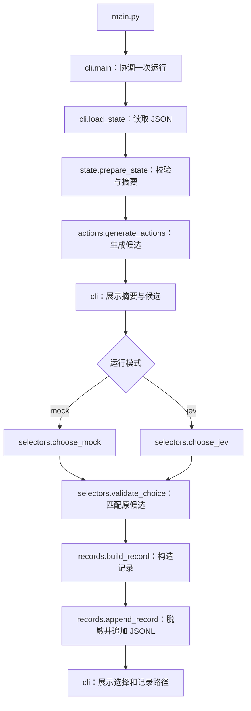

# 目录、模块与函数说明

本项目采用一条明确的单步决策流水线：读取 CommunicationMod JSON、提取摘要、生成候选、选择候选、保存记录。
终端是当前输入输出方式；状态和动作模块不依赖终端或模型 SDK，便于以后接入实时游戏。

## 1. 目录说明

```text
slay-jev-spire/
├── main.py                         # 启动入口
├── pyproject.toml                  # Python 版本、依赖、包发现与测试配置
├── .gitignore                     # 排除密钥、运行记录、环境和缓存
├── .gitattributes                 # 跨 Windows/Linux 统一文本行尾
├── README.md                      # 安装、运行、支持范围与实际验证状态
├── docs/
│   ├── architecture.md            # 本文：目录、接口、函数和扩展位置
│   └── windows.md                 # Windows 原生开发与密钥设置
├── slay_jev_spire/                 # 业务代码
│   ├── __init__.py                 # 声明 Python 包，无初始化副作用
│   ├── models.py                   # 模块共享的 Action / Decision / DecisionRecord 类型
│   ├── state.py                    # 协议状态校验与摘要提取
│   ├── actions.py                  # 从已校验摘要生成候选及实际命令
│   ├── selectors.py                # 模拟或 Jev 选择，校验返回 ID
│   ├── records.py                  # 构造记录、脱敏、追加 JSONL
│   └── cli.py                      # 命令行输入输出与流程协调
├── samples/
│   └── communication_mod_combat.json # 官方 README 完整 JSON 示例
├── tests/
│   ├── test_state.py               # 状态覆盖范围、摘要和原始索引
│   ├── test_actions.py             # 独立候选生成，不修改输入
│   ├── test_selectors.py           # 返回 ID 校验与本地 SDK 接口验证
│   ├── test_records.py             # 记录结构、密钥脱敏和追加写入
│   └── test_cli.py                 # 整条模拟链路零网络、缺少密钥的提示
├── logs/                          # 运行生成的 JSONL；不加入 Git
│   └── decisions.jsonl            # 默认记录文件
└── .venv/                         # 本机 Python 环境与第三方依赖；不加入 Git
```

`__pycache__/`、`.pytest_cache/`、`*.egg-info/` 是 Python、pytest 或安装工具生成的文件，
不属于业务代码，不需要手动维护。

## 2. 一次运行的调用顺序



`prepare_state` 是状态准备的公共入口，内部委托动作模块；这样外部调用仍然只需要一次准备操作，
同时出牌命令的实现集中在 `actions.py`。各模块单向依赖，不互相循环导入。

| 模块 | 负责的内容 | 文件/网络/终端副作用 |
| --- | --- | --- |
| `models` | 共享数据字段和类型 | 无 |
| `state` | 判断状态是否被支持，提取摘要 | 无 |
| `actions` | 费用/目标过滤、动作 ID、命令和说明 | 无 |
| `selectors` | 在候选中选择，并校验返回值 | 只有 `choose_jev` 读取密钥、调用网络 |
| `records` | 记录结构与持久化 | 读取密钥进行脱敏，追加记录文件 |
| `cli` | 参数、文件输入、流程协调、终端展示 | 读样本、显示输出，调用记录模块 |

约束：候选命令由程序生成，选择器只能返回候选。任何模块都不执行游戏命令。
模拟选择器没有 SDK 导入，整个模拟路径只需要标准库。

## 3. 模块之间传什么数据

### 状态摘要

原始 `game_state.combat_state` 被转换为以下四部分；无关的地图、牌堆顺序和其他完整协议字段保留在原始记录中。

| 摘要字段 | 内容 |
| --- | --- |
| `turn` | 战斗回合 |
| `player` | `current_hp`、`max_hp`、`block`、`energy` |
| `hand` | 每张牌的原始 `hand_index`、命令用 `play_index`、UUID、ID、名称、费用、可用性、目标类型与基础效果 |
| `enemies` | 每个怪物的原始 `target_index`、名称、生命、格挡、离场/半死标志、意图、调整后伤害与攻击次数 |

摘要仍是普通字典，具体结构在状态适配器中统一生成。负数伤害和攻击次数转为 `None`，JSON 中为 `null`。
无效或未覆盖的状态抛出 `UnsupportedState`，不让后续模块猜测规则。

### 共享类型

`models.py` 使用 `TypedDict` 描述接口，数据在运行时仍然是普通字典；这些类型用于阅读和静态检查，
运行时范围校验由 `state.py` 和 `selectors.py` 完成。

| 类型 | 字段 | 含义 |
| --- | --- | --- |
| `Action` | `id`、`command`、`description` | 候选 ID、实际游戏命令、展示/模型用说明 |
| `Action` | `hand_index`、`card_uuid`、`target_index` | 原始牌位置、UUID 和怪物位置；无相关位置时为 `None` |
| `Decision` | `action` | 候选列表中的原动作，禁止由模型自行生成命令 |
| `Decision` | `requested_model`、`returned_model`、`confidence` | 模型元数据；模拟时均为空 |
| `DecisionRecord` | `timestamp`、`mode`、`raw_state`、`summary`、`instructions`、`candidates`、`decision` | 一条完整的可复查单步记录 |

索引例子：`hand_index=2` 对应 `PLAY 3`；`target_index=2` 对应目标参数 `2`。
过滤后继续使用这些原始索引，不能用候选列表的位置替代。

## 4. 各个函数的职责

下划线开头的函数是模块内部实现；其他模块应优先调用公共入口。
代码中的中文 docstring 与本表一致，可在 VS Code 悬停查看。

### `state.py`：状态适配

| 函数 | 输入 → 输出 | 职责 |
| --- | --- | --- |
| `prepare_state(raw)` | 原始协议字典 → `(summary, actions)` | 公共入口；协调范围校验、摘要提取和候选生成，统一状态错误，拒绝空候选 |
| `_validate_context(raw)` | 原始协议字典 → `(combat, commands)` | 校验游戏内、稳定战斗、铁甲战士、无选择界面、允许的遗物及无 limbo |
| `_summarize_player(player)` | 玩家协议字段 → 玩家摘要 | 校验存活、无 powers/充能球，提取生命、格挡和能量 |
| `_summarize_hand(hand)` | 原始手牌数组 → 手牌摘要数组 | 校验基础牌和属性，保留原始位置与 UUID，加入基础效果说明 |
| `_summarize_enemies(monsters)` | 原始怪物数组 → 怪物摘要数组 | 校验无 powers 与字段，保留原索引，未知伤害保持未知，要求存在可选目标 |
| `_require(condition, message)` | 校验条件与安全提示 → 无返回值 | 条件不成立时抛出 `UnsupportedState` |
| `_integer(value, minimum)` | 待检查值 → 整数 | 拒绝布尔值和无效数字；默认下限为零，可显式允许负数 |
| `_string(value)` | 待检查值 → 非空字符串 | 拒绝缺失或错误类型的文字字段 |

`CARDS` 保存已覆盖牌的目标类型和基础效果；`RELICS` 保存允许的遗物 ID。
`UnsupportedState` 是供 CLI 捕获的状态错误类型。

### `actions.py`：候选生成

| 函数 | 输入 → 输出 | 职责 |
| --- | --- | --- |
| `generate_actions(summary, available_commands)` | 已校验摘要、命令列表 → `list[Action]` | 检查 `play/end` 可用性、牌费用与能量、存活目标，生成稳定 ID、精确命令和说明；不修改输入，无候选返回 `[]` |

该函数的前提是摘要由状态适配器校验；它不接收任意未校验的原始协议 JSON。

### `selectors.py`：选择候选

| 函数 | 输入 → 输出 | 职责 |
| --- | --- | --- |
| `validate_choice(choice, actions)` | 模型返回值、候选 → 原 `Action` | 只接受精确匹配的字符串 ID；错误类型、未知/缺失 ID 抛出 `SelectionError` |
| `choose_mock(summary, actions)` | 摘要、候选 → `Decision` | 固定选择第一个候选；摘要参数保留以便与真实选择器接口一致 |
| `choose_jev(summary, actions)` | 摘要、候选 → `Decision` | 读取环境密钥、延迟导入 SDK、发送一次 `Choice` 请求、校验 ID、提取元数据；不重试 |

`MODEL` 是默认请求模型；`INSTRUCTIONS` 是模型选择指令，也是记录的一部分。
`SelectionError` 是供 CLI 捕获的选择错误类型，不携带原始 API 响应。

### `records.py`：记录与脱敏

| 函数 | 输入 → 输出 | 职责 |
| --- | --- | --- |
| `safe_text(text)` | 文本 → 脱敏文本 | 遮盖当前已配置密钥及其 JSON 转义形式；共用于终端输出和记录 |
| `build_record(raw_state, summary, candidates, decision, mode, instructions)` | 本次决策输入输出 → `DecisionRecord` | 添加 UTC 时间并组合字段，不写文件、不修改输入 |
| `append_record(path, record)` | 记录路径、记录 → 无返回值 | 序列化、脱敏、创建父目录、追加一行 JSONL；文件错误向上传递 |

### `cli.py`：命令行控制层

| 函数 | 输入 → 输出 | 职责 |
| --- | --- | --- |
| `main(argv=None)` | 参数列表或当前命令行 → 退出码 | 协调一次运行；检查输入/输出路径不同、调用各模块、展示安全错误；成功 0，预期运行错误 1 |
| `_parse_args(argv)` | 参数列表 → `argparse.Namespace` | 定义并解析 `--mode`、`--state`、`--log`；参数格式错误由 argparse 处理 |
| `load_state(path)` | 样本路径 → 原始 JSON 数据 | 仅完成 UTF-8 文件读取和 JSON 解码，业务校验交给状态模块 |
| `_print_candidates(summary, candidates)` | 摘要与候选 → 无返回值 | 展示脱敏局面、候选 ID、命令和说明 |
| `_print_decision(mode, decision, log_path)` | 模式、选择、记录路径 → 无返回值 | 记录成功后展示选择、返回模型/置信度和文件位置 |

`ROOT` 和 `DEFAULT_STATE` 定位随项目附带的默认样本。
`main.py` 不再定义业务函数：直接调用 `cli.main`，把返回值交给 `SystemExit`。

## 5. 测试函数在验证什么

| 文件 / 函数 | 检查内容 |
| --- | --- |
| `test_state.raw` | pytest fixture；每个测试重新加载一份独立官方样本 |
| `test_official_sample_commands_and_unknown_damage` | 官方样本命令、摘要范围、重复牌 UUID 与未知伤害 |
| `test_filtered_cards_and_targets_keep_original_indices` | 跳过不可用牌、昂贵牌、死亡/离场/半死怪物后仍使用原索引 |
| `test_available_commands_gate_candidates` | `play/end` 命令控制候选；没有可选命令时拒绝 |
| `test_unsupported_states_are_rejected` | 参数化覆盖未支持角色、界面、powers、牌、遗物等状态 |
| `test_malformed_state_is_friendly` | 字段缺失统一返回状态错误 |
| `test_negative_damage_is_unknown_not_guessed_from_base_damage` | 不用基础伤害代替未知调整后伤害 |
| `test_generate_actions_preserves_inputs_and_original_indices` | 独立动作模块结果正确，不修改输入，空命令返回空候选 |
| `test_selectors.actions` | pytest fixture；提供两个候选供选择器测试 |
| `test_exact_choice_maps_to_existing_action` | ID 精确匹配后返回原候选对象 |
| `test_invalid_choice_is_rejected` | 错误类型、未知 ID、命令文本和额外空白都被拒绝 |
| `test_jev_sdk_request_and_response` | 用本地 HTTP transport 检查 SDK 请求格式、固定地址、重试设置和响应解析；内部 `handle/client` 是替代网络的测试辅助函数 |
| `test_missing_answer_is_rejected` | 用本地假客户端检查缺失答案不会形成选择；内部 `Client` 仅为测试替身 |
| `test_build_and_append_record_with_redaction` | 记录字段、两次追加、两个密钥脱敏和选择属于候选 |
| `test_mock_cli_without_keys_or_network_appends_records` | 子进程中禁止 socket 和 SDK 导入，仍可完整运行、追加并解析记录；内部 `deny` 是网络禁止钩子 |
| `test_jev_missing_key_does_not_write_record` | 缺少环境密钥时明确提示，且不写成功记录 |

## 6. 后续功能应该放在哪里

以下是后续功能的确定归属。未来路径是实施对应功能时才创建的目标位置，当前没有这些实现。

| 要增加的功能 | 文件位置 | 应放入的逻辑 |
| --- | --- | --- |
| 新角色、牌或状态支持 | `slay_jev_spire/state.py` | 协议字段解析、覆盖范围校验、摘要字段和基础效果 |
| 新动作类型或出牌命令规则 | `slay_jev_spire/actions.py` | 候选枚举、过滤、原始索引映射、命令拼装 |
| 模拟选择规则或 Jev 指令 | `slay_jev_spire/selectors.py` | 当前单步选择规则、提示词、返回 ID 校验 |
| 新的记录字段 | `slay_jev_spire/models.py`、`slay_jev_spire/records.py` | 先更新数据契约，再更新记录构造/序列化 |
| CLI 参数或终端排版 | `slay_jev_spire/cli.py` | 参数、显示、退出码；不实现牌规则 |
| DeepSeek 分析 | `slay_jev_spire/analysis/deepseek.py` | DeepSeek 请求、分析与可检验策略建议；消费摘要/决策，不执行命令 |
| CommunicationMod 实时传输 | `slay_jev_spire/transport/communication_mod.py` | `ready` 握手、逐行 JSON、命令写入与刷新；输出协议文本，不输出终端说明 |
| 离线/实时共享的单步流程 | `slay_jev_spire/application.py` | 在第二个入口加入时，从 CLI 提取“准备 → 选择 → 构造记录”的公共流程 |
| 完整对局的循环控制 | `slay_jev_spire/session.py` | 读取下一状态、调用单步流程、协调传输、结束对局；不自行解析牌字段 |
| 多个可对比的策略版本 | `slay_jev_spire/strategies/policy.py` | 策略配置、版本标识、决策指令；和模型请求代码分开 |
| 固定种子与独立评估局 | `slay_jev_spire/evaluation/runner.py`、`metrics.py` | 前者组织评估对局，后者计算指标；明确区分策略生成数据与独立评估数据 |
| 多服务共用的环境配置 | `slay_jev_spire/config.py` | 在 DeepSeek/实时入口加入时集中读取环境与校验配置；不存储密钥文件 |

当 Jev 调用、策略规则和多个服务不再适合放在同一文件时，把 `selectors.py` 拆成
`selectors/__init__.py`、`selectors/validation.py`、`selectors/mock.py`、`selectors/jev.py`：
分别保留公共导出、返回值校验、模拟选择和 Jev 适配。
删除原同名 `.py` 文件，避免同时存在 `selectors.py` 和 `selectors/`；保持公共导入路径不变。

当前模块数量与单步 CLI 的规模对应，不预先加入插件框架、数据库或完整游戏引擎。
实际验证状态以 [README](../README.md) 为准。

## 7. 现有函数的固定放置位置

这张表是维护时的归属规则。函数应按职责放入对应文件，而不是按“在哪里调用”决定位置。

| 文件的完整相对路径 | 该文件拥有的函数或类型 |
| --- | --- |
| `main.py` | 仅启动 `cli.main` 并转换退出码，不定义业务函数 |
| `slay_jev_spire/cli.py` | `main`、`_parse_args`、`load_state`、`_print_candidates`、`_print_decision` |
| `slay_jev_spire/state.py` | `prepare_state`、`_validate_context`、`_summarize_player`、`_summarize_hand`、`_summarize_enemies`、`_require`、`_integer`、`_string`；`UnsupportedState`、`CARDS`、`RELICS` |
| `slay_jev_spire/actions.py` | `generate_actions`；所有动作 ID 和命令字符串的生成逻辑 |
| `slay_jev_spire/selectors.py` | `validate_choice`、`choose_mock`、`choose_jev`；`SelectionError`、`MODEL`、`INSTRUCTIONS` |
| `slay_jev_spire/records.py` | `safe_text`、`build_record`、`append_record` |
| `slay_jev_spire/models.py` | `Action`、`Decision`、`DecisionRecord`；共享数据契约 |
| `slay_jev_spire/__init__.py` | 包说明；不在这里初始化 SDK、加载密钥或执行流程 |

文件读取目前属于离线 CLI 的输入适配，因此 `load_state` 放在 `cli.py`。
将来第二个入口需要同一种文件输入时，移动到 `transport/file.py`，由各入口复用。
密钥脱敏目前属于输出边界，`safe_text` 放在 `records.py`，CLI 直接复用；不复制一份实现。

### 允许的依赖方向

| 调用方 | 可以依赖的项目模块 |
| --- | --- |
| `main.py` | `cli` |
| `cli` | `state`、`selectors`、`records`、`models` |
| `state` | `actions`、`models` |
| `actions` | `models` |
| `selectors` | `models`；真实模式在函数内部导入第三方 SDK |
| `records` | `models` |
| `models` | 标准库类型定义 |

低层模块不反向导入 `cli`；选择器不导入记录写入器；记录模块不调用模型；
状态/动作模块不读取环境变量、不访问网络、不读写文件。
未来的 `application` 协调各能力，传输模块只负责协议输入输出，两者通过参数和返回值交换数据。

### 新增代码时的维护规则

1. 先判断职责：解析状态、枚举动作、选择动作、保存记录、传输数据或协调流程，再按归属表选择文件。
2. 对外函数使用明确的输入输出；模块内部辅助函数使用 `_` 前缀，不从其他模块直接调用。
3. 错误类型归属于产生错误的模块，例如状态错误在 `state.py`，选择错误在 `selectors.py`；由入口决定如何展示。
4. 同时修改共享字段的定义、产生者、消费者及记录说明。保留牌和目标的原始索引，不用候选序号代替。
5. 每个业务模块的测试放在根目录 `tests/test_<模块名>.py`；不要把测试放入业务包或 `main.py`。
6. 新增子包后，测试同步归到 `tests/analysis/`、`tests/transport/` 或 `tests/evaluation/`；可复用状态样本放在 `samples/`，运行产物放在 `logs/`。
7. 文档放在 `docs/`，安装/运行入口保留在 README；环境和依赖配置留在根目录 `pyproject.toml`。
8. 不建立混装状态规则、请求、文件操作的 `utils.py`。共用函数先归到最明确的职责模块，出现独立职责后再单独拆文件。
